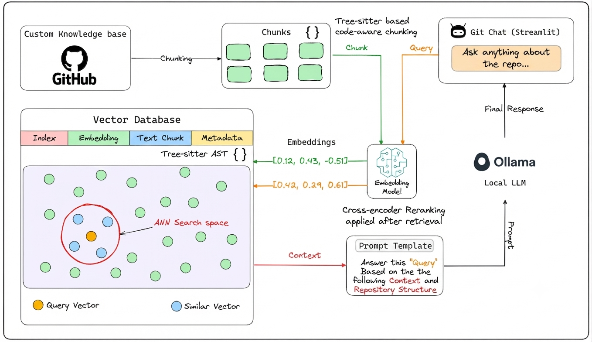

# 💬 Git Chat

A local AI coding assistant that lets you chat with any public GitHub repository.

Git Chat uses **RAG, code-aware chunking, semantic retrieval, cross-encoder reranking, AST analysis, and a local LLM** to provide repository-aware answers.



## ✨ Features

* 🔗 Load any public GitHub repository
* 🌐 Multi-language code support
* ✂️ Tree-sitter based code-aware chunking
* 🔎 Semantic code retrieval
* 🎯 Cross-encoder reranking
* 🌳 AST-based repository analysis
* 💾 Persistent Chroma vector store
* 🔄 Git commit-aware index reuse
* 💬 Conversational follow-up questions
* 🤖 Local LLM support through Ollama
* 🔁 Easily switch between compatible local models
* 🖥️ Simple Streamlit interface

## 🛠️ Tech Stack

* **Python**
* **LangChain**
* **Tree-sitter**
* **Chroma**
* **Hugging Face**
* **Sentence Transformers**
* **Ollama**
* **Qwen 2.5 Coder 3B**
* **Streamlit**

## 📁 Project Structure

```
git_chat/
│
├── answer.py
├── ast_analyser.py
├── context_builder.py
├── embeddings.py
├── github_loader.py
├── llm.py
├── retriever.py
├── streamlit_app.py
├── text_splitter.py
├── vector_store.py
│
├── architecture-diagram.png
├── requirements.txt
├── README.md
└── .gitignore
```

## 🚀 Setup

### 1. Clone the repository

```
git clone <your-repository-url>
cd git_chat
```

### 2. Create a virtual environment

Python 3.12 is recommended.

```
py -3.12 -m venv venv
.\venv\Scripts\Activate.ps1
```

### 3. Install dependencies

```
pip install -r requirements.txt
```

### 4. Install Ollama

Install Ollama from:

https://ollama.com/

Then download the default coding model:

```
ollama pull qwen2.5-coder:3b
```

### 5. Choose a local model

The LLM can be changed directly in `llm.py`.

```
from langchain_ollama import ChatOllama

def load_llm():
    llm = ChatOllama(
        model="qwen2.5-coder:3b",
        temperature=0
    )
    return llm
```

You can replace `qwen2.5-coder:3b` with another compatible Ollama model without changing the rest of the RAG pipeline.

### 6. Run Git Chat

```
streamlit run streamlit_app.py
```

Enter a GitHub repository URL in the sidebar and start chatting with your codebase.

## 💬 Example Questions

```
How does the application load the repository?

Where is this function called?

How does authentication work?

Why is this class used here?

How does this component interact with the database?
```

Follow-up questions are also supported using conversation history.

## 🔄 Repository Updates

Git Chat tracks the repository's current Git commit.

* **Same commit:** the existing vector store and AST are reused.
* **New commit:** the repository is re-indexed.

This avoids rebuilding the index unnecessarily.

## 📝 Notes

Git Chat is a project focused on exploring **RAG over software repositories**.

The application runs locally and can use different compatible Ollama models depending on available hardware and desired response quality.

## 🎯 Goal

To explore how **RAG can be combined with code structure, semantic retrieval, reranking, and conversational context** to build an AI assistant for real-world GitHub repositories.
